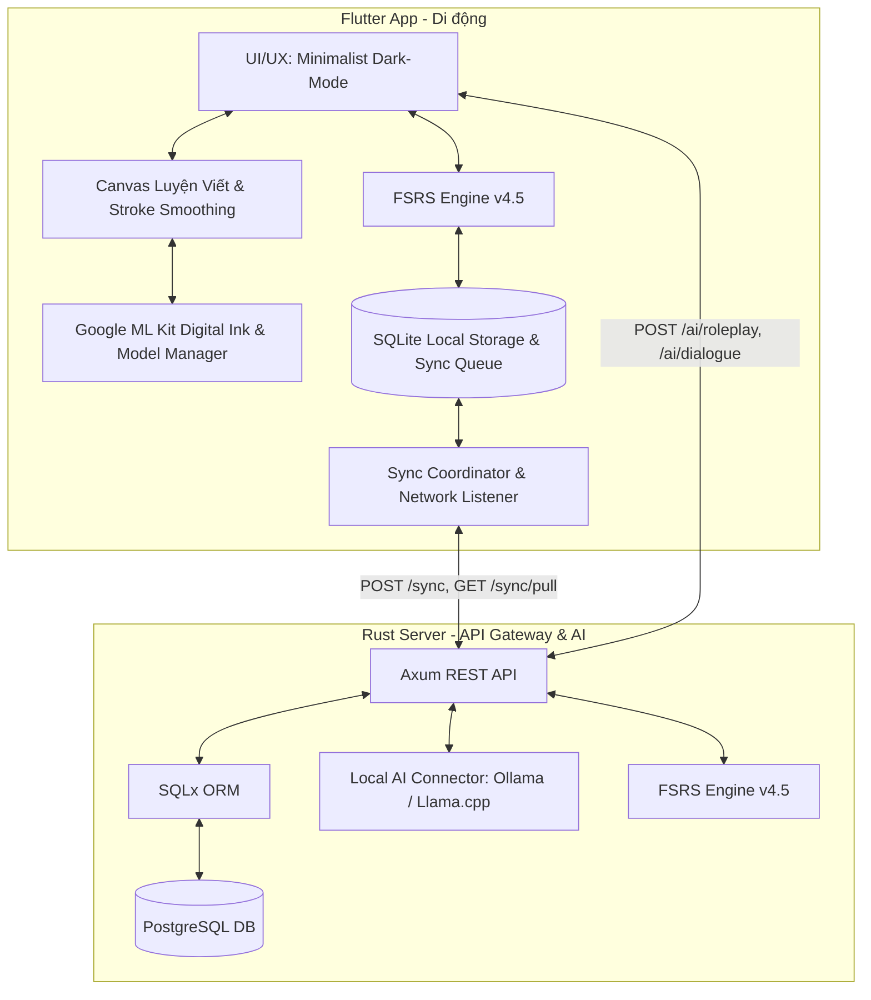

# Project: Lingua Canvas (Full Feature Expansion - Gen 2)

## Architecture
Lingua Canvas is an offline-first English and Japanese learning application pairing a minimalist Flutter mobile frontend with a high-performance Rust Axum backend, Local AI (Ollama / Llama.cpp), Google ML Kit Digital Ink handwriting recognition, and Free Spaced Repetition Scheduler (FSRS-4.5).

## Feature Inventory
Every feature from the Survey phase and user requirements is cataloged and assigned to a milestone:

| # | Feature | Description | Milestone | Source |
|---|---------|-------------|-----------|--------|
| 1 | Local AI Provider Connector | OpenAI-compatible HTTP client for Ollama / Llama.cpp with configurable base URL and timeout | M1 | survey_server |
| 2 | Roleplay Generation Endpoint | `POST /api/v1/ai/roleplay` for professions (IT, Hospitality, Business, General) across difficulty levels | M1 | survey_server |
| 3 | Dialogue Generation Endpoint | `POST /api/v1/ai/dialogue` for context-aware English & Japanese conversations with structured JSON schema | M1 | survey_server |
| 4 | AI Resilience & Fallback | Graceful zero-downtime offline fallback responses when local LLM is unreachable or disabled | M1 | survey_server |
| 5 | Digital Ink Model Manager | Check, download, delete, and cache `en-US` and `ja-JP` ML Kit recognition models | M2 | survey_app |
| 6 | Smooth Handwriting Canvas | 3-point moving average jitter filtering and velocity-dependent stroke width tapering | M2 | survey_app |
| 7 | Real-Time Recognition & Scoring | Multi-tier evaluation (exact candidate match, rank penalty, Levenshtein ratio, stroke count) with debounced feedback | M2 | survey_app |
| 8 | Headless CI & Offline Fallback | `DigitalInkEngine` abstraction supporting `MlKitDigitalInkEngine`, `HeuristicDigitalInkEngine`, and `MockDigitalInkEngine` | M2 | survey_app |
| 9 | SQLite Local Storage | Persistent local tables (`local_lessons`, `local_fsrs_cards`, `local_review_logs`, `local_sync_queue`, `local_completed_lessons`) via `sqflite` | M3 | survey_sync |
| 10 | On-Device FSRS Execution | Local calculation of FSRS interval/stability/difficulty updates with zero latency | M3 | survey_sync |
| 11 | Backend Sync Migration & Routes | PostgreSQL migration `20261001000002_sync_and_review_logs.sql` and endpoints `POST /api/v1/sync` & `GET /api/v1/sync/pull` | M3 | survey_sync |
| 12 | Bidirectional Sync & LWW Conflict | Opportunistic syncing of queued reviews upon reconnection with Last-Write-Wins and idempotency | M3 | survey_sync |
| 13 | E2E Test Suite Expansion | 4-tier E2E tests verifying dialogue AI, ML Kit canvas scoring, offline sync queuing and reconciliation | M4 | survey_sync |
| 14 | Security & Quality Verification | `cargo check/clippy/test`, `flutter analyze/test`, secrets scan, zero regressions | M4 | survey_sync |
| 15 | GitNexus Graph Sync & Remote Push | Full re-index with GitNexus and secure push to `https://github.com/duyphan0503/lingua_canvas` | M4 | survey_sync |

## Milestones
| # | Name | Scope | Dependencies | Status |
|---|------|-------|-------------|--------|
| M0 | Survey & Architecture Mapping | Map full scope and dependencies across server, app, and sync | none | DONE |
| M1 | Backend Local AI Integration | Rust Axum Ollama/Llama.cpp connector, roleplay/dialogue endpoints, fallbacks, tests | M0 | DONE (automated verification) |
| M2 | Mobile ML Kit & Smooth Canvas | Digital Ink model manager, smoothing, scoring, headless mock engine, widget tests | M0 | DONE (implementation and automated tests; device checks pending) |
| M3 | Offline Storage & Bidirectional Sync | SQLite local tables, FSRS offline review, PostgreSQL sync routes, LWW conflict resolution | M1, M2 | DONE (SQLite and PostgreSQL verified) |
| M4 | Comprehensive E2E Tests & Remote Sync | 100% test pass across server/app/e2e, GitNexus update, secure commit & push | M3 | LOCAL_TESTS_VERIFIED; dependency audit clearance and remote integration pending |

## Continuation Verification — 2026-10-02

- Backend: 38 tests passed, including opt-in tests against temporary PostgreSQL 16; formatting, check and Clippy passed.
- Flutter: 82 tests passed; analyze and app-wide formatting checks passed.
- E2E: all 47 cases/scenarios passed against a clean PostgreSQL database, using a freshly built server.
- AI provider/timeout suite: 59 tests passed with isolated local provider fixtures. Adversarial HTTP suite: 42 tests passed, including 100 concurrent requests.
- One live Flutter SQLite queue → Rust HTTP → PostgreSQL smoke test passed, including successful queue cleanup and no duplicate FSRS advancement on repeat sync.
- E2E runner lifecycle: 3 unit tests passed.

Reviews now persist locally before network work. Sync retries on startup, resume, after a review, and every 30 seconds while foregrounded; background refresh preserves an active drawing. Pull cursors and installation IDs persist in SQLite. Interrupted queue rows recover, pending local cards remain protected, and review IDs are unique.

Server reviews and logs commit together; failed DB writes return errors, and retries remain idempotent. PostgreSQL mutations and pulls share an advisory lock with receipt timestamps to keep the timestamp cursor consistent. This serializes operations; higher throughput would require a different cursor design. Memory fallback remains process-local.

Remaining validation: install/run the Android build on a device, build/run on iOS, download and recognize with native ML Kit, exercise airplane-mode recovery on a device, and check a real Ollama/Llama.cpp deployment. iOS configuration requires 15.5; its native build needs macOS/Xcode. Dependency audit clearance and remote push/PR integration are remaining M4 steps. See `TEST_READY.md` for reproducible commands and verification scope.

Further continuation: Gitleaks scanned the five-commit history and current source without findings. The security workflow now fails on cargo-audit errors. `quinn-proto` was updated to 0.11.15; the unpatched `rsa` advisory remains in optional SQLx lock dependencies, although it is inactive with current features on all targets. The audit still fails and has not been suppressed. All 38 Rust tests passed again with PostgreSQL after the lockfile patch. Device and live-provider procedures are prepared in `DEVICE_VALIDATION.md`; no device or real AI provider is currently available on this host.

Android debug compilation is now verified: `app/build/app/outputs/flutter-apk/app-debug.apk` was produced using an isolated Android SDK 36 and passed ZIP/checksum checks. Device installation and native recognition accuracy are still pending. Build-only SDK/cache copies were cleaned up and the original local configuration restored.

## Interface Contracts

### Axum Local AI (`server/src/routes.rs` & `server/src/ai.rs`)
- `POST /api/v1/ai/roleplay`
  - Input: `{ "target_language": "ja" | "en", "topic": "string", "user_level": "beginner" | "intermediate" | "advanced", "user_message": "string", "profession": "it" | "hospitality" | "business" | "general" }`
  - Output: `{ "reply": "string", "opening_line": "string", "reply_translation_vi": "string", "breakdown": [{"word": "string", "meaning_vi": "string", "kana_or_phonetic": "string"}], "writing_challenge": "string", "grammar_hints": [...], "suggested_replies": ["string"], "suggested_responses": ["string"] }`
- `POST /api/v1/ai/dialogue`
  - Input: `{ "target_language": "ja" | "en", "topic": "string", "turn_count": integer, "difficulty_level": "beginner" | "intermediate" | "advanced", "profession": "it" | "hospitality" | "business" | "general" }`
  - Output includes `topic`, `profession`, `difficulty_level`, `title`, `title_vi`, `lines`, `vocabulary`, `grammar_hints`, and `suggested_writing_targets`. Lines contain `speaker`, `text`, `translation_vi`/`translation`, and `phonetic_or_romaji`/`romaji`.
  - Request aliases `language`, `context`, `turns`, and `difficulty` remain supported. Roleplay handlers and the dialogue handler live in `server/src/routes.rs`.

### Flutter Digital Ink Engine (`app/lib/services/digital_ink_engine.dart`)
- Abstract class `DigitalInkEngine`:
  - `Future<bool> isModelDownloaded(String languageTag);`
  - `Future<bool> downloadModel(String languageTag);`
  - `Future<bool> deleteModel(String languageTag);`
  - `Future<List<String>> getCandidates(List<HandwritingStroke> strokes, String languageTag);`
  - `void dispose();`
- `HandwritingRecognizer` evaluates candidates against the target and returns the recognition score. Language tags are normalized to ML Kit's `en` and `ja` identifiers.
- Implementations:
  - `MlKitDigitalInkEngine`: calls `google_mlkit_digital_ink_recognition` (active on mobile Android/iOS)
  - `HeuristicDigitalInkEngine`: geometric stroke & bounding box fallback when offline/model uninstalled
  - `MockDigitalInkEngine`: deterministic candidate simulator for automated tests in Linux CI

### Bidirectional Sync (`server/src/routes/sync.rs` & `app/lib/services/sync_coordinator.dart`)
- `POST /api/v1/sync`
  - Input: `{ "client_id": "string", "reviews": [{"review_id": "string", "item_id": "string", "rating": integer, "review_time": "ISO-8601 UTC"}], "completed_lessons": [{"lesson_id": "string", "completed_at": "ISO-8601 UTC"}] }`
  - Output includes `synced_reviews`, `synced_lessons`, `synced_review_ids`, `synced_completed_lesson_ids`, `updated_cards`, `timestamp`, and `server_time`.
  - Send the canonical `review_id` once; `id` is a legacy input alias for the same field.
- `GET /api/v1/sync/pull?since=ISO-8601`
  - Output: `{ "cards": [FsrsCardJson], "lessons": [LessonJson], "server_time": "ISO-8601 UTC" }`

## Code Layout
- `server/src/`:
  - `ai.rs`: Ollama / Llama.cpp HTTP client, system prompts, offline fallback templates
  - `routes/sync.rs`: Axum handlers for `POST /api/v1/sync` and `GET /api/v1/sync/pull`
  - `routes.rs`: AI, lesson and review handlers, shared state; `lib.rs` registers API routes
  - `fsrs.rs`: FSRS v4.5 engine logic
  - `migrations/20261001000002_sync_and_review_logs.sql`: PostgreSQL schema for sync
- `app/lib/`:
  - `services/digital_ink_engine.dart`: Interface + MlKit/Heuristic/Mock implementations
  - `services/digital_ink_engine.dart` also manages native language model download, deletion and cached recognizers
  - `services/local_database.dart`: SQLite storage for lessons, cards, review logs, and sync queue
  - `services/sync_coordinator.dart`: Bidirectional sync manager & network listener
  - `widgets/handwriting_canvas.dart`: Canvas with 3-point smoothing and velocity tapering
  - `screens/canvas_practice_screen.dart`: Handwriting UI with real-time debounced feedback
- `tests/e2e/`:
  - `tier1_feature_coverage.py`: Expanded endpoint and component coverage
  - `tier2_boundary_cases.py`: AI outage fallbacks, invalid sync payloads, boundary checks
  - `tier3_cross_feature.py`: Offline review queue -> online sync -> FSRS state update
  - `tier4_real_world.py`: Full end-to-end user workflows
