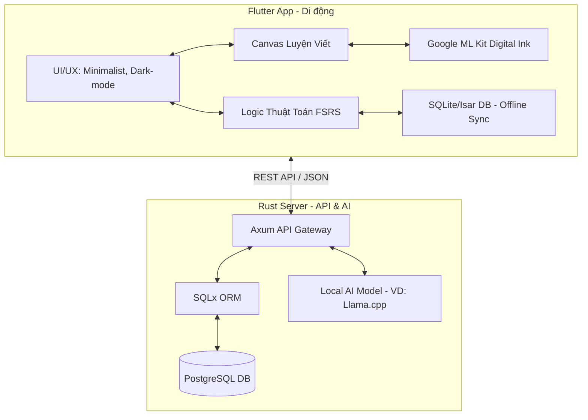

## Mục tiêu dự án (Goal Description)
Xây dựng một ứng dụng học tiếng Anh và tiếng Nhật trên nền tảng di động (Flutter) kết hợp backend (Rust) và AI local nhẹ. 
Đối tượng hướng đến:
- Người mất gốc tiếng Anh, vốn từ vựng ít, đã từng học theo phương pháp cũ nhưng không hiệu quả.
- Người mới bắt đầu học tiếng Nhật với mục tiêu đi làm.

Điểm nhấn: Cho phép người dùng luyện viết trực tiếp trên màn hình điện thoại (để kích thích trí nhớ cơ bắp) và áp dụng các phương pháp học tập cải tiến, thực chiến, khắc phục nhược điểm của các phương pháp học truyền thống.

## Quyết định công nghệ & Tính năng cốt lõi (Technical Decisions)
Dựa trên những thống nhất qua quá trình trao đổi, ứng dụng sẽ được xây dựng với cấu hình như sau:

1. **Công cụ nhận diện nét chữ (Handwriting Engine):**
   - **Lựa chọn:** Google ML Kit Digital Ink.
   - **Lý do:** Rất nhẹ, độ chính xác cao, hoạt động mượt mà offline ngay trên ứng dụng Flutter. Phù hợp nhất để luyện viết Kanji, Hiragana, và tiếng Anh.
2. **Kiến trúc AI (AI Core):**
   - **Lựa chọn:** Chạy mô hình AI nhỏ (Small Language Model) trên Backend Rust cá nhân.
   - **Lý do:** Cân bằng hoàn hảo. Backend Rust kết nối với model AI giúp xử lý sinh hội thoại nhanh, bảo mật dữ liệu và quan trọng nhất là không làm ứng dụng điện thoại bị phình to (vài GB) hay gây nóng máy/tốn pin.
3. **Backend Rust:**
   - **Lựa chọn:** Framework Axum kết hợp ORM SQLx và cơ sở dữ liệu PostgreSQL.
   - **Lý do:** Kiến trúc hiện đại, hiệu năng cực cao, an toàn và dễ maintain. Rất phù hợp để làm API Gateway giao tiếp với AI Local và đồng bộ tiến độ người học.
4. **Nguồn dữ liệu học tập (Content Strategy):**
   - **Lựa chọn:** Hybrid (Kết hợp tĩnh và động).
   - **Lý do:** App sẽ có sẵn giáo trình chuẩn (từ vựng cốt lõi, JLPT N5/N4, TOEIC) làm nền tảng vững chắc. Đồng thời, kết hợp AI để sinh hội thoại thực chiến, đóng vai (Role-play) dựa trên ngành nghề (IT, nhà hàng, v.v.) mà người dùng nhập vào.
5. **Thuật toán ôn tập (Spaced Repetition System):**
   - **Lựa chọn:** FSRS (Free Spaced Repetition Scheduler).
   - **Lý do:** Đây là thuật toán tiên tiến nhất hiện nay, vượt trội hơn SM-2 (Anki), giúp giảm thời gian ôn tập vô ích và tối đa hóa khả năng ghi nhớ dài hạn.
6. **UI/UX & Gamification:**
   - **Lựa chọn:** Minimalist & Dark-mode.
   - **Lý do:** Dành riêng cho người lớn/người đi làm. Giao diện sạch sẽ, chuyên nghiệp, tập trung toàn bộ vào canvas luyện viết. Các yếu tố Gamification được thiết kế tinh tế, tĩnh lặng để không gây xao nhãng.

## Kiến trúc hệ thống tổng thể (System Architecture)

## User Review Required
> [!IMPORTANT]
> Toàn bộ các hướng thiết kế (Tech stack, AI, Thuật toán, UI) đã được chốt dựa trên lựa chọn của bạn. 
> Vui lòng xem lại bản thiết kế này một lần cuối. Nếu bạn đồng ý, hãy bấm **"Proceed"** để chúng ta chính thức khởi tạo Project (Tạo thư mục Flutter, tạo thư mục Backend Rust, và bắt đầu code các module đầu tiên).

## Kế hoạch kiểm thử (Verification Plan)
### Automated Tests
- **Flutter:** Viết Unit tests cho thuật toán FSRS đảm bảo tính toán ngày ôn tập chính xác. Widget tests cho màn hình vẽ chữ.
- **Rust:** Viết Unit tests cho Axum API endpoints (Login, Sync bài học) và kết nối SQLx.

### Manual Verification
- Người dùng thực tế cài app thử vẽ chữ "A", "B" (Tiếng Anh) và "あ", "い" (Tiếng Nhật) để kiểm tra độ trễ của ML Kit.
- Giả lập mất mạng (Airplane mode) trên điện thoại, vẽ xong chữ, bật mạng lại để kiểm tra xem tiến độ có đồng bộ lên server PostgreSQL thông qua Rust hay không.
